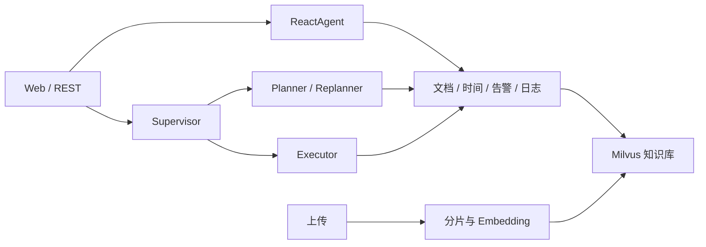

# OnCall AI Agent

面向 Java 后端与 AI 应用开发的智能运维实践项目，基于 SuperBizAgent 二次开发。

**Java 17 · Spring Boot · Spring AI Alibaba · DashScope · Milvus · SSE**

## 功能与改造

继承功能：TXT/Markdown 文档分片入库、向量检索、ReactAgent 工具调用、最近 6 轮会话、SSE 问答，以及 Supervisor / Planner / Executor 告警诊断。

本次改造：

- 拒绝上传路径穿越、盘符和目标符号链接，限制单文件 2 MB。
- 索引失败返回 HTTP 503，区分“文件保存”和“知识库入库成功”。
- 默认关闭外部 MCP，Mock 日志按配置注册；缺少 MCP Provider 时本地工具仍可使用。
- 聊天和 AIOps 统一读取 `rag.model`。
- 补充回归测试、GitHub Actions、启动说明与凭据忽略规则。



## 本地启动

需要 JDK 17、Maven 3.9+、Docker Compose 和可用的 DashScope API Key。默认告警/日志使用模拟数据，模型和向量库仍是真实服务，不是离线或零费用模式。

```bash
docker compose -f vector-database.yml up -d
```

等待 Milvus 健康后启动应用。PowerShell：

```powershell
$env:DASHSCOPE_API_KEY = '填写自己的密钥'
mvn spring-boot:run
```

Linux/macOS：

```bash
export DASHSCOPE_API_KEY='填写自己的密钥'
mvn spring-boot:run
```

访问 http://localhost:9900 ，先上传 `aiops-docs` 中的 Markdown，再询问故障排查方法或启动 AIOps 分析。模拟数据不代表真实环境故障。

## 配置

| 配置 | 默认值 / 用法 |
| --- | --- |
| `DASHSCOPE_API_KEY` | 必填，不要提交到仓库 |
| `SERVER_ADDRESS` | `127.0.0.1`，仅本地监听 |
| `PROMETHEUS_MOCK_ENABLED` | `true`；真实环境设 `false` 并配置 `prometheus.base-url` |
| `CLS_MOCK_ENABLED` | `true`；MCP profile 默认关闭 |
| `SPRING_PROFILES_ACTIVE` | 设置 `mcp` 启用腾讯 CLS MCP |
| `TENCENT_MCP_SSE_ENDPOINT` | MCP 模式必填，完整 `/sse/...` 路径 |
| `rag.model` | `qwen3-max` |
| `dashscope.embedding.model` | `text-embedding-v4`，Collection 预设 1024 维 |

外部日志接入配置位于 `application-mcp.yml`。本地日志工具仅提供 Mock；真实 CLS 依赖外部 MCP。更换 Embedding 模型必须校验向量维度与已有 Collection。

## API

| 接口 | 用途 |
| --- | --- |
| `POST /api/chat` | 普通对话 |
| `POST /api/chat_stream` | SSE 对话 |
| `POST /api/ai_ops` | 告警分析，完成后分块输出报告 |
| `POST /api/upload` | Multipart 字段 `file`，保存并索引 |
| `POST /api/chat/clear` | 清空会话 |
| `GET /api/chat/session/{sessionId}` | 会话信息 |
| `GET /milvus/health` | 向量库连接检查 |

聊天请求：`{"Id":"demo-1","Question":"如何排查 CPU 使用率过高？"}`。客户端应保持同一个 `Id`；当前不返回服务器自动生成的会话 ID。

## 验证与边界

```bash
mvn --batch-mode --no-transfer-progress verify
```

测试使用临时目录和 Mock 服务，不依赖云密钥或 Milvus。覆盖路径越界、正常上传、索引失败、空文件/格式校验、无 MCP Provider 和 Mock 条件注册。GitHub Actions 使用 Java 17 执行同一命令。

当前未实现认证、持久化会话、同会话请求串行化、索引版本切换或 Agent 硬性循环预算。索引逐分片写入，失败可能留下部分索引；AIOps 并非逐步骤实时流。不要直接将应用或 Compose 数据服务暴露到公网。

## 来源与许可证

基于本地提供的 SuperBizAgent `release-2026-01-02` 改造，原 README 署名 chief。原始远程地址未随代码提供，因此不猜测上游链接。保留原 `LICENSE`（Apache License 2.0）；原 README 的 MIT 标注已按许可证文件纠正。

本次改造与继承功能已在上文区分。简历参考 [docs/resume.md](docs/resume.md)。
