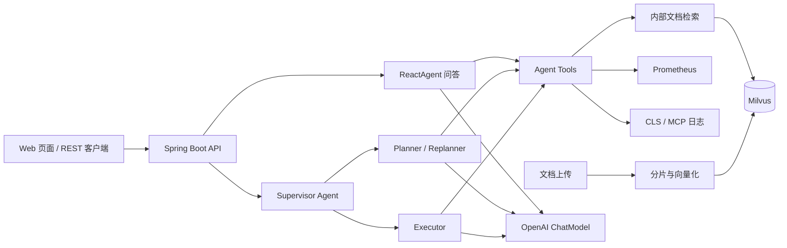

# OnCall AI Agent

OnCall AI Agent 是面向企业运维场景的智能问答与告警诊断平台。它把运维知识库、监控告警、日志工具和大模型 Agent 结合起来，为研发与 SRE 提供可追溯的排障辅助。

## 核心功能

- RAG 运维知识库：支持 TXT/Markdown，按标题和段落分片，使用 OpenAI `text-embedding-3-small` 向量化并写入 Milvus。
- 两阶段检索：Milvus 先召回候选文档，Cross Encoder/Reranker 对候选内容重新打分，最终只将 Top-K 高相关内容交给 Agent。
- 多轮 Agent 问答：ReactAgent 根据问题自动调用时间、内部文档、Prometheus 告警、CLS 日志和 MCP 工具。
- AIOps 诊断：Supervisor 调度 Planner 与 Executor，基于监控、日志和知识库证据输出告警分析报告。
- 流式交互：`/api/chat_stream` 和 `/api/ai_ops` 使用 SSE 返回长耗时结果。
- 工程安全：上传文件名校验、路径穿越防护、符号链接防护、大小限制，以及文件保存和向量索引状态分离。

## RAG 数据流

```text
TXT / Markdown
    -> 标题与段落分片（最大 800 字符，重叠 100 字符）
    -> OpenAI text-embedding-3-small
    -> Milvus oncall_knowledge_openai（1536 维，IVF_FLAT）
    -> Milvus 向量召回（启用 Rerank 时默认 Top 12）
    -> Cross Encoder 精排
    -> 最终 Top 3
    -> Agent 基于内容、来源、分数和元数据生成答案
```

Rerank 默认关闭，未配置时保持原有的 Milvus 向量检索行为。开启后，默认通过 SiliconFlow 的兼容接口调用 `BAAI/bge-reranker-v2-m3`；Rerank 服务异常时默认回退到向量召回结果，也可以通过 `RAG_RERANK_FAIL_ON_ERROR=true` 改为直接报错。

首次迁移到 OpenAI Embedding 后，应用会自动创建新集合 `oncall_knowledge_openai`；原有 `biz` 集合不会删除。请重新上传 `aiops-docs` 中的文档完成重建索引。

## AIOps 编排

```text
Supervisor
    -> Planner 制定排查计划
    -> Executor 调用监控、日志、知识库工具
    -> Planner 根据证据重新规划
    -> Supervisor 判断是否结束
    -> 输出告警分析报告
```

当前主要用于告警分析和诊断，不执行重启、扩容、回滚等高风险变更。默认 Prometheus/CLS 使用 Mock 数据；真实 CLS 查询依赖 MCP 配置。AIOps 报告采用流式分块输出，不表示每个内部 Agent 步骤都会实时展示。

## 系统架构



## 技术栈

| 技术 | 用途 |
| --- | --- |
| Java 17 / Spring Boot 3.2 | 后端服务与 REST API |
| Spring AI OpenAI | `gpt-5.6-terra` 对话模型和 `text-embedding-3-small` 向量模型 |
| Spring AI Alibaba Agent Framework | ReactAgent、Supervisor、Planner、Executor 编排 |
| Milvus | 向量存储和相似度检索 |
| Prometheus / CLS / MCP | 告警和日志数据源 |
| SSE | 问答与诊断报告流式输出 |
| Docker Compose | 本地 Milvus 依赖编排 |

## 本地运行

环境要求：JDK 17、Maven 3.9+、Docker Compose、OpenAI API Key。

OpenAI API Key 需要用户自行创建并配置，ChatGPT Plus 或 Codex 的登录状态不能替代 API Key。项目只读取本机环境变量，不会把 Key 写入配置文件。

### 1. 启动 Milvus

```bash
docker compose -f vector-database.yml up -d
```

### 2. 配置 OpenAI Key

PowerShell：

```powershell
$env:OPENAI_API_KEY = "你的 OpenAI API Key"
```

Linux/macOS：

```bash
export OPENAI_API_KEY="你的 OpenAI API Key"
```

可选配置 OpenAI 兼容网关：

```powershell
$env:OPENAI_BASE_URL = "https://你的网关地址"
```

可选开启 Cross Encoder 精排（需要单独的 Rerank 服务密钥；OpenAI Key 不等同于 Rerank Key）：

```powershell
$env:RAG_RERANK_ENABLED = "true"
$env:RAG_RERANK_API_KEY = "你的 SiliconFlow API Key"
$env:RAG_RERANK_MODEL = "BAAI/bge-reranker-v2-m3"
$env:RAG_RECALL_TOP_K = "12"
```

### 3. 启动应用

```bash
mvn spring-boot:run
```

应用地址：<http://localhost:9900>。启动时会校验 `OPENAI_API_KEY`，缺少时直接提示 `OPENAI_API_KEY is required`。

默认配置适合本地演示：Prometheus 和 CLS Mock 开启，MCP 关闭。真实环境可设置 `PROMETHEUS_MOCK_ENABLED=false`，并配置 `prometheus.base-url`；启用 MCP 时使用 `SPRING_PROFILES_ACTIVE=mcp` 和 `TENCENT_MCP_SSE_ENDPOINT`。

## 配置项

| 配置 | 默认值 | 说明 |
| --- | --- | --- |
| `OPENAI_API_KEY` | 无 | 必填，不提交到仓库 |
| `OPENAI_BASE_URL` | `https://api.openai.com` | OpenAI 兼容网关，可选 |
| `OPENAI_CHAT_MODEL` | `gpt-5.6-terra` | 对话、Agent 和 AIOps 模型 |
| `OPENAI_EMBEDDING_MODEL` | `text-embedding-3-small` | RAG 向量模型 |
| `RAG_RERANK_ENABLED` | `false` | 是否启用 Cross Encoder 精排 |
| `RAG_RERANK_API_KEY` | 无 | Rerank 服务 API Key，可选 |
| `RAG_RERANK_URL` | SiliconFlow `/v1/rerank` | Rerank 服务地址 |
| `RAG_RERANK_MODEL` | `BAAI/bge-reranker-v2-m3` | Rerank 模型 |
| `RAG_RECALL_TOP_K` | `12` | 启用 Rerank 时的初始召回数量 |
| `RAG_RERANK_FAIL_ON_ERROR` | `false` | Rerank 失败时是否拒绝回退 |
| `SERVER_ADDRESS` | `127.0.0.1` | Web 服务监听地址 |
| `PROMETHEUS_MOCK_ENABLED` | `true` | 是否使用 Mock 告警 |
| `CLS_MOCK_ENABLED` | `true` | 是否使用 Mock 日志 |
| `SPRING_PROFILES_ACTIVE` | 无 | 设置为 `mcp` 启用 MCP |
| `TENCENT_MCP_SSE_ENDPOINT` | 无 | MCP 模式下的 SSE endpoint |

## API

| 方法 | 路径 | 说明 |
| --- | --- | --- |
| POST | `/api/chat` | 普通 Agent 问答 |
| POST | `/api/chat_stream` | SSE 流式 Agent 问答 |
| POST | `/api/ai_ops` | SSE 告警分析 |
| POST | `/api/upload` | 上传 TXT/Markdown 并建立索引 |
| POST | `/api/chat/clear` | 清空会话历史 |
| GET | `/api/chat/session/{sessionId}` | 查询会话信息 |
| GET | `/milvus/health` | 检查 Milvus 连接 |

普通问答：

```bash
curl -X POST http://localhost:9900/api/chat \
  -H "Content-Type: application/json" \
  -d '{"Id":"demo-1","Question":"如何排查 CPU 使用率过高？"}'
```

上传知识库文档：

```bash
curl -X POST http://localhost:9900/api/upload \
  -F "file=@aiops-docs/cpu_high_usage.md"
```

同一 `Id` 可保留多轮上下文；会话当前保存在内存中，服务重启后清空。

## 常见故障排查

- `OPENAI_API_KEY is required`：在启动 Spring Boot 的同一终端设置环境变量。
- 模型不可用：确认账户有目标模型权限，或使用 `OPENAI_CHAT_MODEL` 覆盖模型名。
- 向量维度不匹配：确认使用 `text-embedding-3-small`，并重新上传全部文档；不要把旧 `biz` 集合数据混用于新集合。
- Milvus 连接失败：检查 Docker 容器状态、`milvus.host`、`milvus.port` 和 `/milvus/health`。
- MCP 失败：本地演示保持 MCP 关闭；真实日志查询时检查 `SPRING_PROFILES_ACTIVE` 和 endpoint。
- 上传返回 503：文件已保存但向量索引失败，请检查 OpenAI Key、模型权限和 Milvus 状态后重新上传。
- Rerank 未生效：确认 `RAG_RERANK_ENABLED=true`、Rerank Key 已配置，并查看日志中的 `Rerank 完成` 或回退提示。

## 验证与文档

```bash
mvn --batch-mode --no-transfer-progress verify
```

- [简历与面试说明](docs/resume.md)
- [项目状态](docs/PROGRESS.md)
- [示例运维文档](aiops-docs/)
- [Milvus Compose 配置](vector-database.yml)

## 许可证

Apache License 2.0，详见 [LICENSE](LICENSE)。
