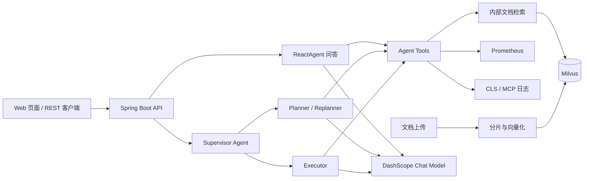

# OnCall AI Agent

OnCall AI Agent 是一个面向企业运维场景的智能问答与故障诊断平台。系统将内部运维知识库、Prometheus 告警、云日志和大语言模型结合起来，为研发、运维和技术支持团队提供可追溯的排障辅助能力。

项目面向 Java 后端与 AI 应用开发场景，重点展示 Spring Boot 服务设计、RAG 检索、Agent 工具调用、多 Agent 编排、SSE 流式输出和外部基础设施集成。

## 核心能力

### RAG 运维知识库

支持上传 TXT 和 Markdown 运维文档，系统会按标题和段落进行分片，调用 DashScope Embedding 生成向量并写入 Milvus。用户提问时，Agent 从知识库检索相关内容，再结合上下文生成答案。

```text
TXT / Markdown
    -> 文档分片
    -> DashScope Embedding
    -> Milvus 向量存储
    -> 相似度检索
    -> Agent 生成答案
```

当前默认配置：

- 分片最大长度：800 字符；重叠长度：100 字符；
- Embedding 模型：`text-embedding-v4`；
- Milvus 索引：`IVF_FLAT`；距离度量：`L2`；
- 默认返回 Top 3 检索结果；
- 检索结果包含正文、来源路径、分数和元数据。

### Agent 智能问答

问答 Agent 使用 ReactAgent，根据问题自动选择工具：

- 查询当前时间；
- 搜索内部运维文档；
- 查询 Prometheus 活跃告警；
- 查询 CLS 日志主题和日志；
- 通过 MCP 接入外部日志工具；
- 使用会话上下文完成多轮对话。

系统同时提供普通响应和 SSE 流式响应，适合长耗时的模型推理和工具调用场景。

### AIOps 告警诊断

AIOps 流程使用 Supervisor、Planner 和 Executor 协作完成告警分析：

```text
Supervisor
    -> Planner 制定排查计划
    -> Executor 调用监控、日志和知识库工具
    -> Planner 根据证据重新规划
    -> Supervisor 判断是否继续或结束
    -> 输出告警分析报告
```

诊断报告会整理活跃告警、症状、日志证据、根因判断、处理建议和风险评估。当前系统用于分析和诊断，不会执行重启、扩容、回滚等高风险变更。

## 系统架构



## 技术栈

| 技术 | 用途 |
| --- | --- |
| Java 17 | 后端开发语言 |
| Spring Boot 3.2 | Web 服务、配置和依赖管理 |
| Spring AI Alibaba | DashScope 模型与 Agent 集成 |
| DashScope | 对话模型和文本向量化 |
| Milvus | 向量存储和相似度检索 |
| Prometheus | 活跃告警查询 |
| 腾讯云 CLS / MCP | 日志查询扩展 |
| SSE | 对话和诊断报告流式输出 |
| Docker Compose | Milvus 本地依赖编排 |

## 本地运行

环境要求：JDK 17、Maven 3.9+、Docker Compose，以及可用的 DashScope API Key。

### 1. 启动 Milvus

```bash
docker compose -f vector-database.yml up -d
```

### 2. 配置 API Key

PowerShell：

```powershell
$env:DASHSCOPE_API_KEY = '填写自己的 DashScope API Key'
```

Linux/macOS：

```bash
export DASHSCOPE_API_KEY='填写自己的 DashScope API Key'
```

### 3. 启动应用

```bash
mvn spring-boot:run
```

打开 <http://localhost:9900>。先上传 `aiops-docs` 目录中的 Markdown 文档，再进行知识库问答或启动 AIOps 分析。

## 配置模式

默认配置适合本地演示：应用只监听本机，Prometheus 和 CLS 使用 Mock 数据，MCP 客户端关闭。

| 配置 | 默认值 | 说明 |
| --- | --- | --- |
| `DASHSCOPE_API_KEY` | 无 | 必填，不要提交到仓库 |
| `SERVER_ADDRESS` | `127.0.0.1` | Web 服务监听地址 |
| `PROMETHEUS_MOCK_ENABLED` | `true` | 是否使用模拟告警 |
| `CLS_MOCK_ENABLED` | `true` | 是否使用模拟日志 |
| `SPRING_PROFILES_ACTIVE` | 无 | 设置为 `mcp` 启用 MCP profile |
| `TENCENT_MCP_SSE_ENDPOINT` | 无 | MCP 模式下的完整 SSE endpoint |
| `rag.model` | `qwen3-max` | 对话模型名称 |
| `dashscope.embedding.model` | `text-embedding-v4` | 向量模型名称 |

真实 Prometheus 环境需要将 `PROMETHEUS_MOCK_ENABLED` 设为 `false`，并配置 `prometheus.base-url`。真实 CLS 日志查询依赖外部 MCP，启用 MCP 时设置 `SPRING_PROFILES_ACTIVE=mcp` 和 `TENCENT_MCP_SSE_ENDPOINT`。默认 Mock 数据仅用于演示，不代表真实生产故障。

更换 Embedding 模型前必须确认向量维度与 Milvus Collection 一致；当前 Collection 预设为 1024 维。

## API

| 方法 | 路径 | 说明 |
| --- | --- | --- |
| POST | `/api/chat` | 普通 Agent 问答 |
| POST | `/api/chat_stream` | SSE 流式 Agent 问答 |
| POST | `/api/ai_ops` | AIOps 告警分析 |
| POST | `/api/upload` | 上传 TXT/Markdown 并建立索引 |
| POST | `/api/chat/clear` | 清空会话历史 |
| GET | `/api/chat/session/{sessionId}` | 查询会话信息 |
| GET | `/milvus/health` | 检查 Milvus 连接 |

普通问答示例：

```bash
curl -X POST http://localhost:9900/api/chat \
  -H "Content-Type: application/json" \
  -d '{"Id":"demo-1","Question":"如何排查 CPU 使用率过高？"}'
```

上传文档示例：

```bash
curl -X POST http://localhost:9900/api/upload \
  -F "file=@aiops-docs/cpu_high_usage.md"
```

客户端应在多轮对话中保持同一个 `Id`。当前会话保存在应用内存中，服务重启后会话历史会清空。

## 安全与工程实践

- 上传文件名会经过路径穿越、盘符和符号链接校验；
- 单文件大小限制为 2 MB，请求大小限制为 3 MB；
- 文件保存成功与向量索引成功分别返回，索引失败会返回 HTTP 503；
- MCP 默认关闭，避免开发环境依赖不可用的外部服务；
- API 默认只监听本机，不建议直接暴露到公网；
- 当前尚未实现登录认证、持久化会话、索引版本切换和自动化变更执行。

## 验证

```bash
mvn --batch-mode --no-transfer-progress verify
```

测试覆盖文件上传边界、索引失败反馈、Mock 工具条件注册和 MCP 缺失时的工具降级。GitHub Actions 会在 Push 和 Pull Request 时使用 Java 17 执行同一构建验证。

## 项目文档

- [简历与面试说明](docs/resume.md)
- [项目状态](docs/PROGRESS.md)
- [示例运维文档](aiops-docs/)
- [Milvus Compose 配置](vector-database.yml)

## 许可证

Apache License 2.0，详见 [LICENSE](LICENSE)。
